# Misty AI Enterprise System - Database Schema

## Entity Relationship Diagram

```mermaid
erDiagram
    %% Core Business Entities
    CUSTOMERS ||--o{ ORDERS : places
    CUSTOMERS ||--o{ REVIEWS : writes
    CUSTOMERS ||--o{ CUSTOMER_INTERACTIONS : has
    CUSTOMERS ||--o{ CUSTOMER_SEGMENTS : belongs_to
    CUSTOMERS {
        uuid customer_id PK
        string email UK
        string first_name
        string last_name
        string phone
        text address
        date date_joined
        decimal lifetime_value
        int total_purchases
        string preferred_genre
        enum status "active, inactive, vip"
        timestamp created_at
        timestamp updated_at
    }

    ALBUMS ||--o{ ORDER_ITEMS : contains
    ALBUMS ||--o{ INVENTORY : tracked_in
    ALBUMS ||--o{ REVIEWS : receives
    ALBUMS ||--o{ REORDER_QUEUE : queued_in
    ALBUMS {
        uuid album_id PK
        string sku UK
        string title
        string artist
        uuid genre_id FK
        uuid label_id FK
        int release_year
        decimal price
        decimal cost
        string condition "NM, VG+, VG, etc"
        text description
        boolean is_rare
        decimal estimated_value
        timestamp created_at
        timestamp updated_at
    }

    GENRES ||--o{ ALBUMS : categorizes
    GENRES {
        uuid genre_id PK
        string name UK
        text description
        decimal avg_margin
        int popularity_score
    }

    LABELS ||--o{ ALBUMS : publishes
    LABELS {
        uuid label_id PK
        string name UK
        string country
        int founded_year
    }

    INVENTORY ||--o{ INVENTORY_TRANSACTIONS : has
    INVENTORY {
        uuid inventory_id PK
        uuid album_id FK
        int quantity
        int reserved_quantity
        int reorder_point
        int optimal_stock_level
        decimal turnover_rate
        int days_in_stock
        timestamp last_restock_date
        timestamp updated_at
    }

    INVENTORY_TRANSACTIONS {
        uuid transaction_id PK
        uuid inventory_id FK
        uuid order_id FK "nullable"
        enum transaction_type "restock, sale, adjustment, return"
        int quantity_change
        decimal unit_price
        text notes
        uuid user_id FK
        timestamp created_at
    }

    ORDERS ||--o{ ORDER_ITEMS : contains
    ORDERS ||--o{ PAYMENTS : has
    ORDERS ||--o{ SHIPMENTS : has
    ORDERS {
        uuid order_id PK
        string order_number UK
        uuid customer_id FK
        decimal subtotal
        decimal tax
        decimal shipping_fee
        decimal total
        enum status "pending, processing, shipped, delivered, cancelled"
        enum channel "in-store, online, phone, corporate"
        text shipping_address
        timestamp order_date
        timestamp created_at
        timestamp updated_at
    }

    ORDER_ITEMS {
        uuid order_item_id PK
        uuid order_id FK
        uuid album_id FK
        int quantity
        decimal unit_price
        decimal discount
        decimal total
    }

    PAYMENTS {
        uuid payment_id PK
        uuid order_id FK
        decimal amount
        enum payment_method "card, cash, bank_transfer"
        enum status "pending, completed, failed, refunded"
        string transaction_id
        boolean fraud_flagged
        decimal fraud_score
        timestamp payment_date
        timestamp created_at
    }

    SHIPMENTS {
        uuid shipment_id PK
        uuid order_id FK
        string tracking_number
        string carrier
        enum status "preparing, shipped, in_transit, delivered"
        timestamp shipped_date
        timestamp estimated_delivery
        timestamp actual_delivery
    }

    %% Customer Service
    CUSTOMERS ||--o{ CASES : creates
    CASES ||--o{ CASE_MESSAGES : has
    CASES {
        uuid case_id PK
        string case_number UK
        uuid customer_id FK
        string subject
        text description
        enum category "order_issue, product_question, return, technical, general"
        enum priority "critical, high, medium, low"
        enum status "pending, in_progress, resolved, closed"
        uuid assigned_to FK "references users"
        string ai_sentiment "happy, neutral, frustrated, angry"
        int ai_score
        text ai_suggestion
        timestamp created_at
        timestamp resolved_at
        timestamp updated_at
    }

    CASE_MESSAGES {
        uuid message_id PK
        uuid case_id FK
        uuid user_id FK "nullable for customer messages"
        text message
        boolean is_internal
        boolean from_customer
        timestamp created_at
    }

    REVIEWS {
        uuid review_id PK
        uuid customer_id FK
        uuid album_id FK
        int rating
        text review_text
        string sentiment "positive, neutral, negative"
        decimal sentiment_score
        boolean verified_purchase
        timestamp created_at
    }

    %% AI & Automation
    AI_RECOMMENDATIONS {
        uuid recommendation_id PK
        enum recommendation_type "reorder, promotion, pricing, customer"
        uuid entity_id "album_id, customer_id, etc"
        text recommendation
        text insight
        int confidence_score
        enum impact "high, medium, low"
        enum status "pending, accepted, dismissed, scheduled"
        json metadata
        timestamp created_at
        timestamp expires_at
    }

    DEMAND_FORECASTS {
        uuid forecast_id PK
        uuid album_id FK
        date forecast_date
        int predicted_demand
        int lower_bound
        int upper_bound
        decimal confidence_level
        string model_version
        json influencing_factors
        timestamp created_at
    }

    REORDER_QUEUE {
        uuid reorder_id PK
        uuid album_id FK
        uuid supplier_id FK
        int current_stock
        int recommended_quantity
        decimal unit_cost
        decimal total_cost
        enum priority "critical, high, medium, low"
        int ai_confidence
        enum status "pending, approved, ordered, received"
        timestamp created_at
        timestamp approved_at
    }

    SUPPLIERS ||--o{ REORDER_QUEUE : supplies
    SUPPLIERS ||--o{ SUPPLIER_PRICING : has
    SUPPLIERS {
        uuid supplier_id PK
        string name
        string email
        string phone
        text address
        decimal avg_delivery_days
        decimal reliability_score
        timestamp created_at
    }

    SUPPLIER_PRICING {
        uuid pricing_id PK
        uuid supplier_id FK
        uuid album_id FK
        decimal unit_price
        int minimum_order_quantity
        date effective_from
        date effective_to
        timestamp created_at
    }

    %% Workflow & Activity
    WORKFLOWS {
        uuid workflow_id PK
        string name UK
        text description
        enum trigger_type "schedule, event, manual, api"
        json trigger_config
        boolean enabled
        int execution_count
        decimal success_rate
        decimal avg_duration_ms
        timestamp created_at
        timestamp updated_at
    }

    WORKFLOWS ||--o{ WORKFLOW_EXECUTIONS : runs
    WORKFLOW_EXECUTIONS {
        uuid execution_id PK
        uuid workflow_id FK
        string execution_number
        enum status "running, complete, error, blocked"
        text description
        int progress_percentage
        timestamp start_time
        timestamp end_time
        int duration_ms
        json execution_log
        text error_message
    }

    %% Customer Insights
    CUSTOMER_SEGMENTS {
        uuid segment_id PK
        uuid customer_id FK
        enum segment_type "vip_collector, regular_enthusiast, casual_buyer, new_customer"
        date assigned_date
        decimal segment_score
    }

    CUSTOMER_INTERACTIONS {
        uuid interaction_id PK
        uuid customer_id FK
        enum interaction_type "email, phone, chat, in_store, online"
        text summary
        string sentiment
        timestamp interaction_date
    }

    CUSTOMER_RECOMMENDATIONS {
        uuid rec_id PK
        uuid customer_id FK
        uuid album_id FK
        decimal recommendation_score
        string reason
        boolean clicked
        boolean purchased
        timestamp created_at
        timestamp expires_at
    }

    CUSTOMERS ||--o{ CUSTOMER_RECOMMENDATIONS : receives
    ALBUMS ||--o{ CUSTOMER_RECOMMENDATIONS : recommended

    %% Analytics & Metrics
    SALES_METRICS {
        uuid metric_id PK
        date metric_date
        enum channel "in-store, online, phone, corporate, all"
        uuid genre_id FK "nullable"
        decimal revenue
        int units_sold
        decimal avg_order_value
        int customer_count
        int new_customers
        timestamp created_at
    }

    INVENTORY_METRICS {
        uuid metric_id PK
        date metric_date
        uuid album_id FK "nullable"
        uuid genre_id FK "nullable"
        int total_skus
        decimal total_value
        decimal turnover_rate
        int low_stock_count
        int out_of_stock_count
        int overstock_count
        timestamp created_at
    }

    %% Users & System
    USERS ||--o{ CASES : handles
    USERS ||--o{ INVENTORY_TRANSACTIONS : performs
    USERS {
        uuid user_id PK
        string email UK
        string password_hash
        string first_name
        string last_name
        enum role "admin, manager, staff, system"
        boolean active
        timestamp last_login
        timestamp created_at
    }

    SYSTEM_LOGS {
        uuid log_id PK
        enum log_level "info, warning, error, critical"
        string source
        text message
        json metadata
        timestamp created_at
    }

    AI_MODEL_CONFIG {
        uuid config_id PK
        string model_name
        string model_provider "openai, anthropic, custom"
        json model_parameters
        decimal accuracy_score
        boolean active
        timestamp created_at
        timestamp updated_at
    }

    %% Integrations
    INTEGRATIONS {
        uuid integration_id PK
        string service_name "stripe, shopify, sendgrid, etc"
        string category
        boolean connected
        json credentials
        json settings
        timestamp last_sync
        timestamp created_at
    }
```



## Key Indexes

```sql
-- Customers
CREATE INDEX idx_customers_email ON customers(email);
CREATE INDEX idx_customers_status ON customers(status);
CREATE INDEX idx_customers_lifetime_value ON customers(lifetime_value DESC);

-- Albums
CREATE INDEX idx_albums_sku ON albums(sku);
CREATE INDEX idx_albums_genre ON albums(genre_id);
CREATE INDEX idx_albums_artist ON albums(artist);
CREATE INDEX idx_albums_price ON albums(price);

-- Inventory
CREATE INDEX idx_inventory_album ON inventory(album_id);
CREATE INDEX idx_inventory_quantity ON inventory(quantity);
CREATE INDEX idx_inventory_turnover ON inventory(turnover_rate DESC);

-- Orders
CREATE INDEX idx_orders_customer ON orders(customer_id);
CREATE INDEX idx_orders_status ON orders(status);
CREATE INDEX idx_orders_date ON orders(order_date DESC);
CREATE INDEX idx_orders_channel ON orders(channel);

-- Cases
CREATE INDEX idx_cases_customer ON cases(customer_id);
CREATE INDEX idx_cases_status ON cases(status);
CREATE INDEX idx_cases_priority ON cases(priority);
CREATE INDEX idx_cases_assigned ON cases(assigned_to);

-- AI & Forecasting
CREATE INDEX idx_recommendations_type ON ai_recommendations(recommendation_type);
CREATE INDEX idx_recommendations_status ON ai_recommendations(status);
CREATE INDEX idx_forecasts_album_date ON demand_forecasts(album_id, forecast_date);

-- Workflow
CREATE INDEX idx_executions_workflow ON workflow_executions(workflow_id);
CREATE INDEX idx_executions_status ON workflow_executions(status);
CREATE INDEX idx_executions_time ON workflow_executions(start_time DESC);
```

## Schema Notes

### Design Principles

1. **UUID Primary Keys**: Used for distributed systems and better security
2. **Timestamps**: All tables have created_at; mutable tables have updated_at
3. **Soft Deletes**: Consider adding deleted_at columns for soft delete pattern
4. **Audit Trail**: Critical tables should log changes in separate audit tables
5. **JSON Columns**: Used for flexible metadata and configuration storage

### AI-Specific Tables

- **ai_recommendations**: Stores all AI-generated suggestions
- **demand_forecasts**: ML model predictions for inventory demand
- **customer_recommendations**: Personalized product suggestions
- **ai_model_config**: Configuration for different AI models

### Analytics Tables

- **sales_metrics**: Pre-aggregated sales data for fast reporting
- **inventory_metrics**: Pre-aggregated inventory stats
- Consider implementing time-series tables for high-frequency metrics

### Vector Database (Separate)

For RAG (Knowledge Assistant), you'll need a vector database:
- **Pinecone**, **Chroma**, **Weaviate**, or **pgvector**
- Store embeddings of:
  - Product descriptions
  - Customer interactions
  - Artist information
  - Sales documentation
  - FAQ content

## Data Relationships

### Core Business Flow
```
Customer → Order → Order Items → Albums
                → Payments
                → Shipments
```

### Inventory Management
```
Albums → Inventory → Inventory Transactions
       → Reorder Queue → Suppliers
       → Demand Forecasts
```

### Customer Service
```
Customer → Cases → Case Messages
        → Reviews
        → Customer Interactions
```

### AI & Automation
```
Albums → Demand Forecasts → Reorder Queue
Customers → Customer Recommendations → Albums
Workflows → Workflow Executions
```

## Migration Strategy

1. **Phase 1**: Core business tables (customers, albums, orders)
2. **Phase 2**: Inventory and supplier management
3. **Phase 3**: Customer service (cases, reviews)
4. **Phase 4**: AI tables (recommendations, forecasts)
5. **Phase 5**: Analytics and metrics tables
6. **Phase 6**: Workflow automation tables

## Recommended Technologies

- **PostgreSQL 15+**: Main relational database
- **Pinecone/Chroma**: Vector database for RAG
- **Redis**: Caching layer for frequently accessed data
- **TimescaleDB**: Extension for time-series metrics data
